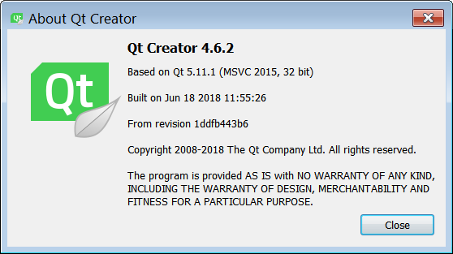
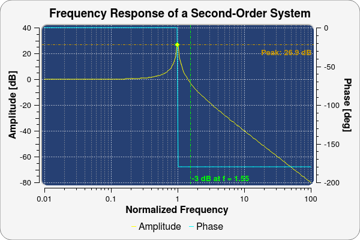

# QWT windows build

* qt-creator-4.8  `qt-5.12.1-msvc2015_amd64`
* qt-creator-4.9  `qt-5.12.4-msvc2017_amd64`

I choose Qt 5.7.0 for my daily used, but keep Qt Creator update. 

So there are a problem: the Qt library shipped with Qt Creator is **newest** !

An the plugin for Qt Creator **must** match that Qt library.

If you didn't need Qt Designer feature, just build libqwt.a,

or you **have to** compile designer plugin yourself:(

I just compile it, for myself.

Windows version Qt Creator built with MSVC, like this:

So I have to install Qt-5.11.1-MSVC2015-64bit + MSVC Build Tools 2015.3...

***The follow brief is offical README***

-----

[QWT](http://qwt.sourceforge.net/)

Qwt - Qt Widgets for Technical Applications

The Qwt library contains GUI Components and utility classes which are primarily useful for programs with a technical background. Beside a framework for 2D plots it provides scales, sliders, dials, compasses, thermometers, wheels and knobs to control or display values, arrays, or ranges of type double.

## License
Qwt is distributed under the terms of the [Qwt License, Version 1.0](http://qwt.sourceforge.net/qwtlicense.html).

## Platforms
Qwt 6.1 might be usable in all environments where you find Qt. It is compatible with Qt4 ( >= 4.4 ) and all Qt5 versions.

## What's new
Read the [summary](http://qwt.sourceforge.net/qwtchangelog.html) of the most important changes.

## Credits
Authors: Uwe Rathmann, Josef Wilgen ( <= Qwt 0.2 )

